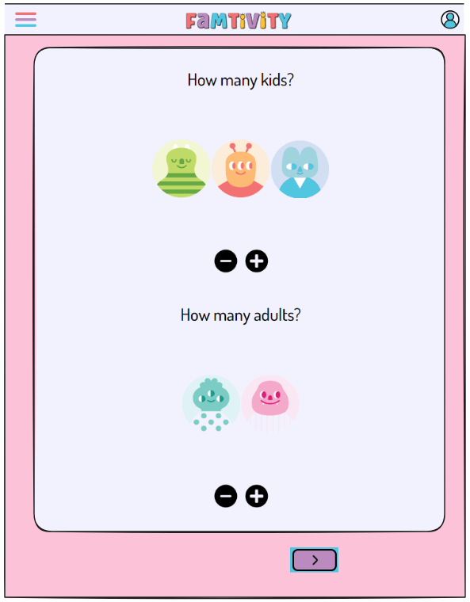

# Project Title

FamTivity

## Overview

FamTivity is an innovative web application designed to help families plan custom family nights based on their preferences, the number of children, and their ages. This project aims to bring families closer by providing tailored activity suggestions that cater to the unique dynamics of each family.

### Problem

Parents often find it challenging to come up with new and engaging activities for their family nights. The time required to research, plan, and organize these activities can be a significant barrier.
Families tend to recycle the same few activities, which can lead to boredom and a lack of enthusiasm for family time. There's a need for a diverse range of activities that cater to different interests and age groups.Traditional methods of planning family activities do not provide interactive elements such as ratings, feedback, and community sharing, which can enhance the overall experience and engagement.

### User Profile

- Families with children of various ages seeking to enhance their quality time together.
- Parents looking for easy and convenient ways to plan engaging activities.
- Caregivers and educators interested in structured yet fun family activities.

### Features

User Registration and Authentication:

- As a user, I want to create an account to personalize my experience and save my preferences.
- As a user, I want to log in and log out securely to protect my personal information.

Family Profile Setup:

- As a user, I want to create profiles for each family member, including ages, to receive tailored activity suggestions.
- As a user, I want to update and manage these profiles to keep the recommendations relevant as my family grows and changes.

Activity Suggestions:

- As a user, I want to receive custom activity suggestions based on my family’s preferences, the number of children, and their ages so that we can have engaging and suitable family nights.
- As a user, I want to filter activity suggestions by type, duration, and difficulty to find the perfect fit for our family night.

Customization and Preferences:

- As a user, I want to save our favorite activities to quickly access them for future family nights.
- As a user, I want to keep a list of previously watched movies so that they are not suggested again on future family nights (unless we so choose).

Discovery:

- A a user, I want to browse popular games, movies and boardgames to see what other families might be playing as well

## Implementation

### Tech Stack

Frontend: Developed using React.js for a dynamic and responsive user interface.

Client libraries: react, react-router, axios

Backend: Node.js and Express.js for server-side operations and API management, MySQL for boardgame database, Passport.js for user login

### APIs

TMDB (Movie Database)
RAWG (Videogame Database)
backend MySQL database with data scraped from BGG (Board Game Geek)

### Sitemap

- Home Page
- Login (with google or github)
- User Profile
- Movie Selection Page => Movie Results Page
- Videogame Selection Page => Videogame Results Page
- Boardgame Selection Page => Boardgame Results Page
- Popular (top 10 Movies / Videogames / Boardgames for kids and families)

### Mockups

#### Home Page


#### Login Page


#### User Profile Page


#### Movie Selection Page


#### Movie Results Page


#### Videogame Pages




#### Boardgame Pages


#### Popular Page


### Data

Boardgame data is independent and acting like an API.
User database has two tables with a one-to-many relationship between users and watched movies


### Endpoints

**GET /boardgames/results**

- gets a listing of boardgames that match the criteria of the query built through the activity selector

Response:

```
[
    {
        "bgg_id":209893,
        "name": "Go, Go Little Penguin",
        "min_age": 2,
        "min_players":2,
        "max_players":3,
        "min_time":5,
        "rank": 19108,
        "year":2016,
        "description":"The penguin mommies and their babies live on an island, but the tasty fi..."
        "image_urls": "https://cf.geekdo-images.com\/345Or5KjNbH_VSPnc7QxsA__original\/img\/RaiEXUeGiDqWTXcCQXTBS1f3tWM=/0x0/filters:format(jpeg)/pic3242728.jpg"
    },
    ...
]
```

**GET /auth/profile**

- User profile endpoint that requires authentication
- If user is currently authenticated, send back user info

```
    {
        "id":5,
        "username":"Lindsay Renna",
        "avatar_url":"https://lh3.googleusercontent.com/a/ACg8ocLlL2y39REoVC7iu1zUP_4kRP4wwKjCaHzx9DAtgBqTnreNerc=s96-c",
    }
```

**GET /user/:userid/watchlist**

- get list of watched movies for user by user_id
- returns list of movies associated with that user

```
[
 {
        "id":10,
        "user_id":5,
        "movie_id":25,
        "movie_name":"Up",
    },
    ...
    ]
```

### Auth

OAuth with Google and GitHub using Passport.js

## Roadmap

**Task 1: Foundation and Core Setup (Week 1-2)**

Environment Setup:

Set up development environment (React, Node.js, database).
Initialize project repository.
User Registration and Authentication:

Implement user registration and login (OAuth with Google and GitHub using Passport.js).
Create secure authentication flow and save user data in the database.
Home Page:

Design and implement the home page UI.
Ensure it’s responsive and user-friendly.

Timeframe:
Environment Setup: 2 days
User Registration and Authentication: 6 days
Home Page: 4 days

**Task 2: Movie Selection and Results (Week 3-4)**

Movie Selection Page:

Design and implement the movie selection page.
Integrate movie API to fetch data.

Movie Results Page:

Design and implement the movie results page.
Display movie suggestions based on user preferences.

User Profile:

Design and implement the user profile page.
Connect user data and display watched movies list.

Timeframe:

Movie Selection Page: 5 days
Movie Results Page: 5 days
User Profile: 5 days

**Task 3: Video Game and Board Game Routes (Week 5-6)**

Video Game Selection Page:

Design and implement the video game selection page.
Integrate video game API to fetch data.

Video Game Results Page:

Design and implement the video game results page.
Display video game suggestions based on user preferences.

Board Game Selection Page:

Design and implement the board game selection page.
Integrate board game API and set up backend database.

Board Game Results Page:

Design and implement the board game results page.
Display board game suggestions based on user preferences.

Timeframe:

Video Game Selection Page: 5 days
Video Game Results Page: 5 days
Board Game Selection Page: 5 days
Board Game Results Page: 5 days

**Tasks 4: Popular Page and Final Touches (Week 7-8)**

Popular Page:

Design and implement the popular page to display top 10 movies, video games, and board games.

Customization and Preferences:

Implement saving favorite activities and watched movies list.
Ensure recommendations exclude previously watched movies unless selected otherwise.

Testing and Bug Fixing:

Perform end-to-end testing of all functionalities.
Fix any bugs and optimize performance.

Timeframe:

Popular Page: 5 days
Customization and Preferences: 5 days
Testing and Bug Fixing: 5 days

## Nice-to-haves

- add additional support for older gaming systems (PS3 / XBOX and older)
- carousel of top popular games / movies / boardgames on front page
- manage a family profile so users do not need to input kids / ages each time

```

```
