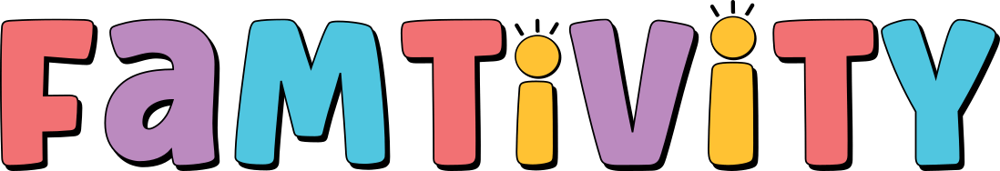

<!-- Improved compatibility of back to top link: See: https://github.com/othneildrew/Best-README-Template/pull/73 -->

<a id="readme-top"></a>

<!--
*** Thanks for checking out the Best-README-Template. If you have a suggestion
*** that would make this better, please fork the repo and create a pull request
*** or simply open an issue with the tag "enhancement".
*** Don't forget to give the project a star!
*** Thanks again! Now go create something AMAZING! :D
-->

<!-- PROJECT SHIELDS -->
<!--
*** I'm using markdown "reference style" links for readability.
*** Reference links are enclosed in brackets [ ] instead of parentheses ( ).
*** See the bottom of this document for the declaration of the reference variables
*** for contributors-url, forks-url, etc. This is an optional, concise syntax you may use.
*** https://www.markdownguide.org/basic-syntax/#reference-style-links
-->

[![Contributors][contributors-shield]][contributors-url]
[![Forks][forks-shield]][forks-url]
[![Stargazers][stars-shield]][stars-url]
[![Issues][issues-shield]][issues-url]
[![MIT License][license-shield]][license-url]
[![LinkedIn][linkedin-shield]][linkedin-url]

<!-- PROJECT LOGO -->
<br />
<div align="center">
  <a href="https://github.com/lindsay-renna/lindsay-renna-capstone">
    
  </a>

<h3 align="center">FamTivity</h3>

  <p align="center">
    FamTivity is an innovative web application designed to help families plan custom family nights based on their preferences, the number of children, and their ages. This project aims to bring families closer by providing tailored activity suggestions that cater to the unique dynamics of each family. <br /><br /> To achieve full functionality you will also need to visit the backend-api portion of the project <a href="https://github.com/lindsay-renna/lindsay-renna-capstone-api">lindsay-renna-capstone-api</a>
    <br /><br />
    <a href="https://github.com/lindsay-renna/lindsay-renna-capstone"><strong>Explore the docs »</strong></a>
    <br />
    <br />
    <a href="https://github.com/lindsay-renna/lindsay-renna-capstone">View Demo</a>
    ·
    <a href="https://github.com/lindsay-renna/lindsay-renna-capstone/issues/new?labels=bug&template=bug-report---.md">Report Bug</a>
    ·
    <a href="https://github.com/lindsay-renna/lindsay-renna-capstone/issues/new?labels=enhancement&template=feature-request---.md">Request Feature</a>
  </p>
</div>

<!-- TABLE OF CONTENTS -->
<details>
  <summary>Table of Contents</summary>
  <ol>
    <li>
      <a href="#about-the-project">About The Project</a>
      <ul>
        <li><a href="#built-with">Built With</a></li>
      </ul>
    </li>
    <li>
      <a href="#getting-started">Getting Started</a>
      <ul>
        <li><a href="#prerequisites">Prerequisites</a></li>
        <li><a href="#installation">Installation</a></li>
      </ul>
    </li>
    <li><a href="#usage">Usage</a></li>
    <li><a href="#roadmap">Roadmap</a></li>
    <li><a href="#contributing">Contributing</a></li>
    <li><a href="#license">License</a></li>
    <li><a href="#contact">Contact</a></li>
    <li><a href="#acknowledgments">Acknowledgments</a></li>
  </ol>
</details>

<!-- ABOUT THE PROJECT -->

## About The Project

This app is designed for:

- Families with children of various ages seeking to enhance their quality time together.
- Parents looking for easy and convenient ways to plan engaging activities.
- Caregivers and educators interested in structured yet fun family activities.

<p align="right">(<a href="#readme-top">back to top</a>)</p>

## Features

- User registration and authentication
- User maintained WatchList to remove watched movies from future results
- Top 10 / popular movie/videogame/board games for families

## Tech Stack

- **Client:** React
- **Server:** Node, Express
- **Database:** MySQL
- **Authentication:** OAuth, Passport.js
- **APIs:** Movie and Video Game APIs for data retrieval, custom boardgame API using MySQL database

## Pages

- Home Page
- Login
- User Profile
- Movie Selection Page
- Video Game Selection Page
- Board Game Selection Page
- Popular Page

<p align="right">(<a href="#readme-top">back to top</a>)</p>

<!-- GETTING STARTED -->

## Getting Started

To get a local copy up and running follow these simple steps:

### Prerequisites

- npm
  ```sh
  npm install npm@latest -g
  ```
- git
- TMDB API Key
- RAWG.io API Key

### Installation

1. Navigate to [TMDB](https://www.themoviedb.org/) and register an account and follow the instructions to receive your own API key and API token.

2. Navigate to [RAWG](https://rawg.io/apidocs) and register an account to receive your own API key.

3. Clone the repo
   ```sh
   git clone https://github.com/lindsay-renna/lindsay-renna-capstone.git
   ```
4. Install NPM packages
   ```sh
   npm install
   ```
5. Create a new .env file with the following variables (see .env.example in the root folder). Replace the values with your API keys and local backend PORT of choice (this is the PORT that the server will run on)

   ```js
   VITE_APP_SERVER_URL=http://localhost:8080
   VITE_RAWG_API_KEY={your_RAWG_api_key}
   VITE_MOVIE_API_TOKEN={your_TMDB_api_token}
   VITE_MOVIE_API_KEY={your_TMDB_api_key}
   ```

6. Open a new terminal window and start the frontend development server.
   ```sh
   npm run dev
   ```
7. Complete the instructions fom the server repo.
8. The application should now be running on http://localhost:5173 (frontend) and http://localhost:8080 (backend).
<p align="right">(<a href="#readme-top">back to top</a>)</p>

<!-- USAGE EXAMPLES -->

## Usage

Use this space to show useful examples of how a project can be used. Additional screenshots, code examples and demos work well in this space. You may also link to more resources.

_For more examples, please refer to the [Documentation](https://example.com)_

<p align="right">(<a href="#readme-top">back to top</a>)</p>

<!-- ROADMAP -->

## Roadmap

- [ ] Create external links to popular items on Popular page
- [ ] Add children profiles to user's profile that will auto-fill children upon selecting an activity route
- [ ] Add "click to buy" feature within the boardgame results modal
- [ ] Add "share" feature that will allow you to share the specific game/movie of your choosing with your partner / kids / etc.

See the [open issues](https://github.com/lindsay-renna/lindsay-renna-capstone/issues) for a full list of proposed features (and known issues).

<p align="right">(<a href="#readme-top">back to top</a>)</p>

<!-- CONTRIBUTING -->

## Contributing

Contributions are what make the open source community such an amazing place to learn, inspire, and create. Any contributions you make are **greatly appreciated**.

If you have a suggestion that would make this better, please fork the repo and create a pull request. You can also simply open an issue with the tag "enhancement".
Don't forget to give the project a star! Thanks again!

1. Fork the Project
2. Create your Feature Branch (`git checkout -b feature/AmazingFeature`)
3. Commit your Changes (`git commit -m 'Add some AmazingFeature'`)
4. Push to the Branch (`git push origin feature/AmazingFeature`)
5. Open a Pull Request

<p align="right">(<a href="#readme-top">back to top</a>)</p>

<!-- LICENSE -->

## License

Distributed under the MIT License. See `LICENSE.txt` for more information.

<p align="right">(<a href="#readme-top">back to top</a>)</p>

<!-- CONTACT -->

## Contact

Lindsay Renna - lrenna.oct@gmail.com

Project Link: [https://github.com/lindsay-renna/lindsay-renna-capstone](https://github.com/lindsay-renna/lindsay-renna-capstone)

<p align="right">(<a href="#readme-top">back to top</a>)</p>

<!-- ACKNOWLEDGMENTS -->

## Acknowledgments

- [https://recommend.games] (Markus Shepherd of recommend.games for the scraped boardgame data)

<p align="right">(<a href="#readme-top">back to top</a>)</p>

<!-- MARKDOWN LINKS & IMAGES -->
<!-- https://www.markdownguide.org/basic-syntax/#reference-style-links -->

[contributors-shield]: https://img.shields.io/github/contributors/lindsay-renna/lindsay-renna-capstone.svg?style=for-the-badge
[contributors-url]: https://github.com/lindsay-renna/lindsay-renna-capstone/graphs/contributors
[forks-shield]: https://img.shields.io/github/forks/lindsay-renna/lindsay-renna-capstone.svg?style=for-the-badge
[forks-url]: https://github.com/lindsay-renna/lindsay-renna-capstone/network/members
[stars-shield]: https://img.shields.io/github/stars/lindsay-renna/lindsay-renna-capstone.svg?style=for-the-badge
[stars-url]: https://github.com/lindsay-renna/lindsay-renna-capstone/stargazers
[issues-shield]: https://img.shields.io/github/issues/lindsay-renna/lindsay-renna-capstone.svg?style=for-the-badge
[issues-url]: https://github.com/lindsay-renna/lindsay-renna-capstone/issues
[license-shield]: https://img.shields.io/github/license/lindsay-renna/lindsay-renna-capstone.svg?style=for-the-badge
[license-url]: https://github.com/lindsay-renna/lindsay-renna-capstone/blob/master/LICENSE.txt
[linkedin-shield]: https://img.shields.io/badge/-LinkedIn-black.svg?style=for-the-badge&logo=linkedin&colorB=555
[linkedin-url]: https://linkedin.com/in/lindsay-renna
[product-screenshot]: images/screenshot.png
